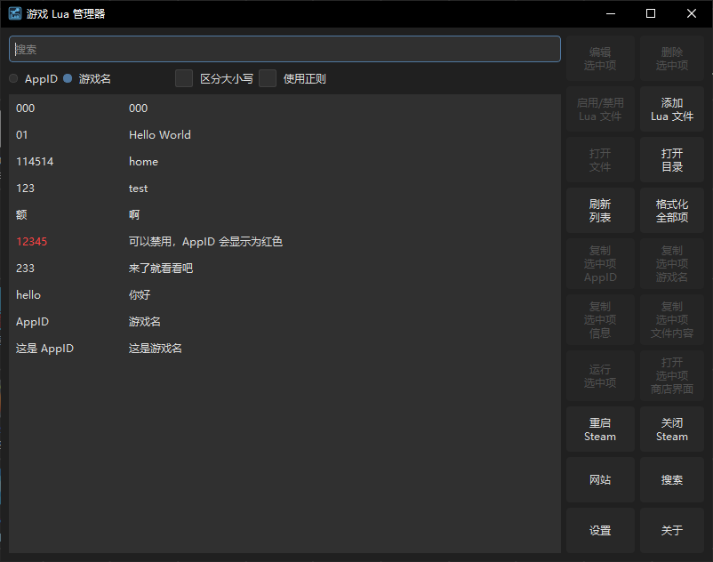
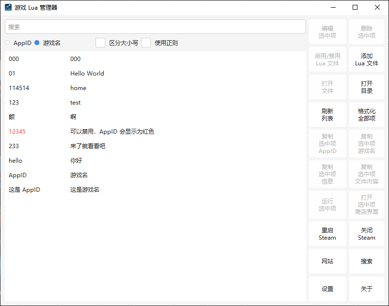

  

  <h1>SteamTools Manifest Manager</h1>
  
一个用于管理 SteamTools 清单（Lua）文件的图形化工具

  
  
    

   

  <h2>界面截图</h2>

  
  

## 功能

**比如你可以：**
- 添加/删除/启用禁用/编辑/打开/格式化 Lua 文件
- 复制 Lua 里的游戏信息（前提是有信息）
- 运行 Lua 里的 AppID 指向的游戏
- 打开 Lua 里的 AppID 指向的商店界面
- 在 **主界面** 和 **添加清单（Lua）界面** 拖拽导入文件
- 关闭/重启 Steam
- 搜索
- 打开一些友情站
- 更多功能...

**注意：**
- 格式化会**删除所有语法不正确及非 addappid 的内容**，虽然没什么影响，但也请谨慎使用

## 使用

### 要求
- Windows 系统
- 已安装 Steam 客户端

### 安装
- 下载最新 Release 里的 7z 压缩包，然后解压到你喜欢的位置
- **如果你想：** 给里面的 `SteamTools Manifest Manager.exe` 添加快捷方式到桌面

### 卸载
- 直接删掉软件文件和快捷方式即可，这软件的设置保存在根目录下，不会往 注册表 和 AppData 里写东西

---

# 开发相关

## 环境
- **构建工具**: qmake

**建议：**
- **Qt**: Qt 6
- **C++ 标准**: C++23
- **构建套件**: LLVM-MinGW

## 部署
- 部署脚本 [deploy.bat](deploy.bat) 依赖 [Bandizip](https://www.bandisoft.com/bandizip) 压缩

---

# 其他

- 官网: https://steamtools-manifest-manager.pages.dev/

## 许可证

本项目采用 MIT 许可证。详见 [LICENSE.txt](LICENSE.txt)。

## 致谢

- 感谢 [SteamTools](https://www.steamtools.net)
- 感谢所有开源库和社区贡献者
